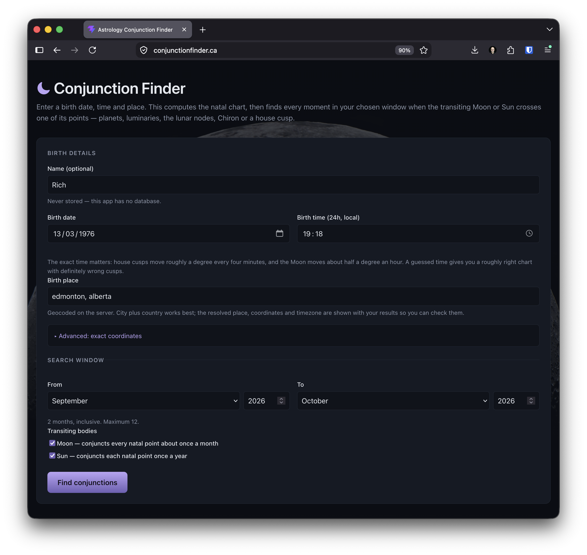

# Astrology Conjunction Finder

Enter a birth date, time and place. The app computes the natal chart, then lists
every moment in a window of up to 12 months when the transiting Moon or Sun
crosses one of its points — planet, luminary, lunar node, Chiron or house cusp.

Output is a data table, not a chart wheel. There is no login, no database and
nothing is stored: every request carries its own birth data and gets its answer
back in the same response.



Live at [conjunctionfinder.ca](https://conjunctionfinder.ca).

## Architecture

```
Browser                     Backend                      Ephemeris
─────────                   ─────────                    ──────────
React + Vite + TS  ──HTTP──▶ FastAPI (uvicorn locally,   pyswisseph
one form, one POST           Mangum + Lambda later)  ──▶  + .se1 files
                                   │                      (backend/ephe)
two tables       ◀────JSON────────┘
                             geopy/Nominatim  → lat, lon
                             timezonefinder   → IANA timezone
                             zoneinfo         → local time → UTC
```

One `POST /api/conjunctions` per search returns the natal chart *and* the sorted
event list, so the page needs no second round trip. The same ASGI app object runs
under uvicorn locally and, via the Mangum adapter it already exports, on Lambda
behind API Gateway.

How a request is answered:

1. **Place → coordinates.** Nominatim geocodes the place name, or you supply
   latitude/longitude directly and no network call happens.
2. **Coordinates → timezone.** `timezonefinder` gives the IANA zone name.
3. **Birth time → UTC.** The date and time are read as *local wall clock* in
   that zone via `zoneinfo`, so the UTC offset rules actually in force on the
   birth date apply — including pre-standardisation local mean time. Then to a
   Julian Day.
4. **Chart.** `swe.calc_ut` for the Sun, Moon, Mercury through Pluto, Chiron and
   the mean lunar node (plus its opposite point); `swe.houses(…, b'P')` for the
   12 Placidus cusps. Retrograde comes from the sign of each body's longitude
   speed, not a lookup table.
5. **Search.** For each of the 25 natal longitudes, `swe.mooncross_ut` /
   `swe.solcross_ut` find the next crossing, the cursor hops forward, and the
   search repeats to the end of the window.
6. **Verify.** Each crossing is re-checked by recomputing the transiting body's
   longitude at that instant; it must land within 1 arcminute of the natal
   target to be reported. In practice it agrees to ~1e-8°.

## Run it locally

Two terminals. Backend first:

```bash
cd backend
uv venv .venv
uv pip install -r requirements.txt
.venv/bin/uvicorn app.main:app --reload --port 8000
```

Then the frontend:

```bash
cd frontend
npm install
npm run dev
```

Open <http://localhost:5173>. Port 5173 is in the backend's default CORS
allowlist, and the frontend defaults to `http://localhost:8000`, so neither side
needs configuring for local development.

Backend tests:

```bash
cd backend && .venv/bin/python -m pytest
```

## Where things live

| Path | What |
| --- | --- |
| `backend/app/` | FastAPI app: routes, schemas, natal chart, transit search, geocoding, ephemeris wrappers |
| `backend/ephe/` | Swiss Ephemeris `.se1` data files, 1800–2400 (`seas_18` is required for Chiron) |
| `backend/tests/` | pytest suite (53 tests, offline by default) |
| `backend/template.yaml` | AWS SAM scaffolding — present and plausible, never deployed |
| `frontend/src/` | React app: one form, natal chart table, events table |
| `reference/moon_transits.py` | The original single-chart CLI prototype this is built from |
| `SPEC.md`, `IDEA.md` | What was asked for |

Each directory has its own README with the detail: `backend/README.md` documents
the API, the environment variables, two pyswisseph behaviours that differ from
what the C API docs imply, and the ephemeris data files.
`frontend/README.md` documents the config, the layout and the manual browser
verification that was actually run.

## Future work

- **Deploy to Lambda.** `backend/template.yaml` wires the Mangum handler through
  API Gateway and is the intended starting point, but it has never been deployed
  or validated against CloudFormation. Expect to work through packaging the
  `.se1` files and the `timezonefinder` dataset into the artifact, cold-start
  time, and the fact that geocoding needs egress to Nominatim (whose usage policy
  wants an identifying user agent and rate limiting — a deployed service should
  probably cache resolved places or move to a paid geocoder).
- **Other aspects.** Conjunction is the 0° case of a general angular
  relationship. Trine (120°), square (90°), opposition (180°) and sextile (60°)
  need no new solver: search for a crossing of `natal_longitude + offset`, which
  `mooncross_ut`/`solcross_ut` already do. The natural shape is an `aspects`
  parameter alongside `bodies`, with the offset carried through onto each event.
- **More transiting bodies.** The same crossing approach generalises past the
  Moon and Sun, but the fast `*cross_ut` solvers are luminary-specific and outer
  planets go retrograde, so a planet can cross the same natal degree three times
  in a few months. That needs a real root-finder over sampled longitudes, not
  just a different constant.
- **Saving and sharing charts.** Deliberately out of scope: it needs a database,
  which the current design explicitly does not have. Adding one changes the
  privacy story from "we cannot have your birth data, we never keep it" to
  something needing retention and deletion policy. A shareable URL that encodes
  the birth data in a query string would get most of the benefit with none of
  that.

## Non-goals

No authentication, no accounts, no persistence. No aspects other than
conjunction. No chart wheel graphic. No deployment executed.
